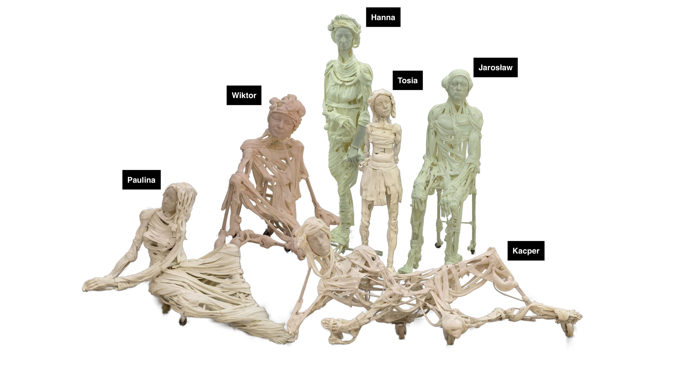

<div align="center">
<h1> HuSc3D: Human Sculpture dataset for 3D object reconstruction</h1>
Weronika Smolak-Dyżewska, Dawid Malarz, Grzegorz Wilczyński, Rafał Tobiasz, Joanna Waczyńska, Piotr Borycki, Przemysław Spurek
<br> <br>


[](https://arxiv.org/abs/2506.07628)  [](https://wmito.github.io/HuSc3D/) [](https://github.com/wMito/HuSc3D)

</div>



This repository contains the code for evaluation made for benchmarking with HuSc3D dataset.
Link to dataset: https://huggingface.co/datasets/rafal-tobiasz/HuSc3D

 

**Abstract:** 3D scene reconstruction from 2D images is one of the most important tasks in computer graphics. Unfortunately, existing datasets and benchmarks concentrate on idealized synthetic or meticulously captured realistic data. Such benchmarks fail to convey the inherent complexities encountered in newly acquired real-world scenes. In such scenes especially those acquired outside, the background is often dynamic, and by popular usage of cell phone cameras, there might be discrepancies in, e.g., white balance.

To address this gap, we present HuSc3D, a novel dataset specifically designed for rigorous benchmarking of 3D reconstruction models under realistic acquisition challenges. Our dataset uniquely features six highly detailed, fully white sculptures characterized by intricate perforations and minimal textural and color variation. Furthermore, the number of images per scene varies significantly, introducing the additional challenge of limited training data for some instances alongside scenes with a standard number of views. By evaluating popular 3D reconstruction methods on this diverse dataset, we demonstrate the distinctiveness of HuSc3D in effectively differentiating model performance, particularly highlighting the sensitivity of methods to fine geometric details, color ambiguity, and varying data availability – limitations often masked by more conventional datasets.

 <h2 class="title">How to evaluate</h2>
 
In order to reproduce our results, we share bash scripts used to run 2DGS, Mip-Splatting, and Nerfstudio methods. `2dgs_benchmark/2dgs.sbatch`, `mip_splatting_benchmark/mipsplat.sbatch`, and `nerfstudio.sbatch` are scripts used on our computational cluster. However, without lines with `#SBATCH` instructions, they can be used like a normal bash script. For Nerfstudio methods, you can use `nerfstudio_benchmark/nerfstudio.sh` directly as such: 
 
 ```bash
 bash nerfstudio_benchmark/nerfstudio.sh
 ```

 In order to correctly run any of these methods, you should run these scrips after activating environment made following instructions from original repositories (<a href="https://github.com/autonomousvision/mip-splatting">Mip-Splatting</a>, <a href="https://github.com/hbb1/2d-gaussian-splatting">2DGS</a>, <a href="https://github.com/nerfstudio-project/nerfstudio">Nerfstudio</a>) and cloning their repository.

 For our evaluation, we needed to make slight changes to 2DGS and Mip-Splatting code to record training time and FPS. To modify these original repositories, use the  provided ```.patch``` files as such:
 ```bash
 cd 2d-gaussian-splatting
 git apply 2dgs_benchmark/2dgs_changes.patch
 ``` 

<section class="section" id="BibTeX">
  <div class="container is-max-desktop content">
    <h2 class="title">Citations</h2>
If you find our work useful, please consider citing:
    <pre><code>@Article{smolakdyzewska2025husc3d,
      title={HuSc3D: Human Sculpture dataset for 3D object reconstruction}, 
      author={Weronika Smolak-Dyżewska and Dawid Malarz and Grzegorz Wilczyński and Rafał Tobiasz and Joanna Waczyńska and Piotr Borycki and Przemysław Spurek},
      year={2025},
      eprint={2506.07628},
      archivePrefix={arXiv},
      primaryClass={cs.CV},
      url={https://arxiv.org/abs/2506.07628}, 
    }
</code></pre>

</div>

</section>
